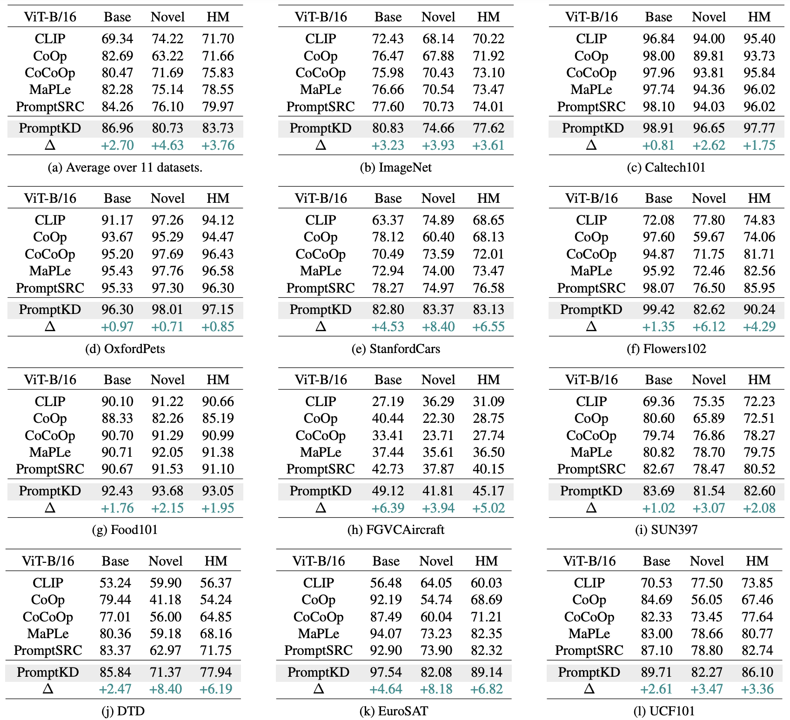

# PromptKD: Unsupervised Prompt Distillation for Vision-Language Models 

<!-- This is the official PyToch implementation for "PromptKD: Unsupervised Prompt Distillation for Vision-Language Models." (CVPR 2024) -->


> [**PromptKD: Unsupervised Prompt Distillation for Vision-Language Models**]() <br>
> Zheng Li, Xiang Li#, Xinyi Fu, Xin Zhang, Weiqiang Wang, Shuo Chen, Jian Yang#. <br>
> Nankai University, Ant Group, RIKEN <br>
> CVPR 2024 <br>
> [[Paper](https://arxiv.org/abs/2403.02781)] [[Project Page](https://zhengli97.github.io/PromptKD)] [[Poster](https://github.com/zhengli97/PromptKD/blob/main/images/promptkd_poster.pdf)] [[中文解读](https://zhengli97.github.io/PromptKD/chinese_interpertation.html)]

<hr />

[](https://paperswithcode.com/sota/prompt-engineering-on-caltech-101?p=promptkd-unsupervised-prompt-distillation-for)
[](https://paperswithcode.com/sota/prompt-engineering-on-dtd?p=promptkd-unsupervised-prompt-distillation-for)
[](https://paperswithcode.com/sota/prompt-engineering-on-eurosat?p=promptkd-unsupervised-prompt-distillation-for)
[](https://paperswithcode.com/sota/prompt-engineering-on-fgvc-aircraft?p=promptkd-unsupervised-prompt-distillation-for)
[](https://paperswithcode.com/sota/prompt-engineering-on-food-101?p=promptkd-unsupervised-prompt-distillation-for)
[](https://paperswithcode.com/sota/prompt-engineering-on-imagenet?p=promptkd-unsupervised-prompt-distillation-for)
[](https://paperswithcode.com/sota/prompt-engineering-on-oxford-102-flower?p=promptkd-unsupervised-prompt-distillation-for)
[](https://paperswithcode.com/sota/prompt-engineering-on-oxford-iiit-pet-dataset?p=promptkd-unsupervised-prompt-distillation-for)
[](https://paperswithcode.com/sota/prompt-engineering-on-stanford-cars-1?p=promptkd-unsupervised-prompt-distillation-for)
[](https://paperswithcode.com/sota/prompt-engineering-on-sun397?p=promptkd-unsupervised-prompt-distillation-for)
[](https://paperswithcode.com/sota/prompt-engineering-on-ucf101?p=promptkd-unsupervised-prompt-distillation-for)

<hr />

### 🔥 News

- Our lab has released a new work that also uses the unsupervised prompt distillation method, Cascade Prompt Learning for Vision-Language Model Adaptation ([[Paper](https://arxiv.org/abs/2409.17805)][[Code](https://github.com/megvii-research/CasPL)]), which has been accepted by ECCV 2024. Feel free to check it out~

<hr />

### 💡Tips:

1. If you are interested in prompt learning and want to know more about related work, we also maintain a [list of awesome papers](https://github.com/zhengli97/Awesome-Prompt-Adapter-Learning-for-Vision-Language-Models) for your reference.
2. If you are trying to reproduce the results of this implementation on the Stanfordcars dataset, the link to this dataset may be broken and unavailable. We have provided the dataset in [github releases](https://github.com/zhengli97/PromptKD/releases/tag/datasets) for your convenience.

<hr />

### Abstract

In this paper, we introduce an unsupervised domain prompt distillation framework, which aims to transfer the knowledge of a larger teacher model to a lightweight target model through prompt-driven imitation using unlabeled domain images. 

To our best knowledge, we are the first to (1) perform unsupervised domain-specific prompt-driven knowledge distillation for CLIP, and (2) establish a practical pre-storing mechanism of text features as shared class vectors between teacher and student.

### Framework

<div style="text-align:center"></div>
<figcaption class="content has-text-left"  style="word-break:normal">Figure 1. An overview of our PromptKD framework. <strong>(a)</strong> We first pre-train a large CLIP teacher model with labeled training images. <strong>(b)</strong> Reuse the existing higher-quality teacher text features for unsupervised prompt distillation. <strong>(c)</strong> The well-trained student and pre-stored teacher text features are utilized for final inference.</figcaption>

### Highlights

(1). A novel two-stage unsupervised prompt distillation framework for Vision-Language Models.

(2). Reuse high-quality teacher text features instead of training the student's own text encoder.

(3). Distillation on large amounts of unlabeled domain images using soft labels provided by the teacher.

(4). PromptKD outperforms all existing prompt learning methods on 11 diverse recognition datasets.

## Experimental Results
Results reported below show accuracy for base and novel classes for across 11 recognition datasets averaged over 3 seeds.

### Base-to-Novel

<figure>

<figcaption class="content has-text-left" style="word-break:normal">Table 1. Comparison with existing state-of-the-art methods on base-to-novel generalization. Our PromptKD demonstrates strong generalization ability and achieves significant improvements on 11 recognition datasets given the <strong> ViT-B/16 image encoder</strong> of the CLIP model. The symbol △ denotes the performance improvement compared to the previous SOTA method.
</figure>

### Cross Dataset

<figure>

<figcaption class="content has-text-left" style="word-break:normal">
Table 2. Comparison of PromptKD with existing advanced approaches on cross-dataset benchmark evaluation. 
Based on our pipeline, we perform unsupervised prompt distillation using the unlabeled domain data respectively (i.e., the transductive setting). 
The source model is trained on ImageNet. "ZSL" denotes the setting type for Zero-Shot Learning.
</figure>

## Running

### Preliminary

1. Create the environment and install Dassl.pytorch library. Please follow the instructions detailed in [INSTALL.md](docs/INSTALL.md).

2. (1) Pre-train your own large teacher CLIP model (See below) or (2) use our publicly released pre-trained teacher ViT-L/14 CLIP models. (**Highly Recommended**)   
Our pre-trained teacher models are publicly available at [[Baidu Yun](https://pan.baidu.com/s/1KNJ1mhNKoxdSli4ZldeZUg?pwd=mjf4)] [[TeraBox](https://terabox.com/s/1X4mxJtSaR8W2lrK5bsrCkg)] [[Google Cloud](https://drive.google.com/drive/folders/1OdQ9WauZmYAzVSUTTw7tIKKChyECIS5B?usp=sharing)]   
(Note that due to cloud space limitations, we only provide a limited number of models in Google Cloud. Sorry.)  
After obtaining the teacher model, unzip these files and place the model in the `./teacher_model` folder.   
The accuracy of each teacher model is shown in Tables 10 and 11 in the supplementary material of the paper.  

3. Download the original ViT-B/16 and ViT-L/14 CLIP model weights from the official OpenAI website. Then place these models in the `./clip` folder.  
[[ViT-B/16 CLIP](https://openaipublic.azureedge.net/clip/models/5806e77cd80f8b59890b7e101eabd078d9fb84e6937f9e85e4ecb61988df416f/ViT-B-16.pt)] [[ViT-L/14 CLIP](https://openaipublic.azureedge.net/clip/models/b8cca3fd41ae0c99ba7e8951adf17d267cdb84cd88be6f7c2e0eca1737a03836/ViT-L-14.pt)]

4. Prepare the dataset. Please follow the instructions detailed in [DATASETS.md](docs/DATASETS.md).

### Train Your Teacher Model (Optional)

In our paper, we default use PromptSRC to pre-train our ViT-L/14 CLIP teacher model. We have already provided the config file in `configs/trainers/PromptSRC/vit_l14_c2_ep20_batch8_4+4ctx.yaml`

If you want to train your own teacher model, first you should change `scripts/promptsrc/base2new_train.sh line 11 CFG=vit_b16_c2_ep20_batch4_4+4ctx` to `vit_l14_c2_ep20_batch8_4+4ctx`.
Then follow the instructions listed in `docs/PromptSRC.md` and run the script.

**Important Note:**  
The accuracy of your own teacher model may vary depending on your computing environment. To ensure that your teacher model is adequate for distillation, please refer to Appendix Table 10 to check whether your model achieves appropriate accuracy. 

If your teacher model cannot achieve the corresponding accuracy or cannot be trained due to computational constraints, I highly recommend that you use our publicly available pre-trained models for distillation.

### Running PromptKD 

#### (1) Base-to-Novel Experiments.

1. The base-to-novel experimental settings are provided in the config file at `configs/trainers/PromptKD/vit_b16_c2_ep20_batch8_4+4ctx.yaml`. You can modify the hyper-parameters in this config file according to your needs.

2. Change the dataset path in `scripts/promptkd/base2new_train.sh line 4` to your current path.

3. Run the commands below to train PromptKD on the specified dataset.

For example:
```
# dataset=imagenet, seed=1 
sh scripts/promptkd/base2new_train.sh imagenet 1

# seed=2
sh scripts/promptkd/base2new_train.sh imagenet 2

# seed=3
sh scripts/promptkd/base2new_train.sh imagenet 3

# dataset=caltech101, seed=1
sh scripts/promptkd/base2new_train.sh caltech101 1
```

4. The output results will be automatically saved at `output/base2new/train_base/${DATASET}/shots_${SHOTS}/${TRAINER}/${CFG}/seed_${SEED}`.

#### (2) Cross-dataset Experiments.

1. The cross-dataset experimental settings are provided in the config file at `configs/trainers/PromptKD/vit_b16_c2_ep20_batch8_4+4ctx_cross_datasets.yaml`. You can modify the hyper-parameteres in this config file according to your needs.

2. Change the dataset path in `scripts/promptkd/xd_train.sh line 4` to your current path.

3. Run the commands below to train PromptKD on the specified dataset.

For example:
```
# dataset=caltech101, seed=1 
sh scripts/promptkd/xd_train.sh caltech101 1

# seed=2
sh scripts/promptkd/xd_train.sh caltech101 2

# seed=3
sh scripts/promptkd/xd_train.sh caltech101 3

# dataset=oxford_pets, seed=1
sh scripts/promptkd/xd_train.sh oxford_pets 1
```
    
4. The output results will be automatically saved at `output/${DATASET}/${TRAINER}/${CFG}_${SHOTS}shots/seed${SEED}`.

## Model Zoo

Here we provide the pretrained student models and complete training logs using 64-shots and 0-shots (i.e., full dataset) on the ImageNet dataset for your reference. Please refer to [[Releases Part](https://github.com/zhengli97/PromptKD/releases)].


## Contact

If you have any questions, you can submit an [issue](https://github.com/zhengli97/PromptKD/issues) on GitHub, leave a message on [Zhihu Article](https://zhuanlan.zhihu.com/p/684269963) (if you can speak Chinese), or contact me by email (zhengli97[at]qq.com).

## Citation

If you find our paper or repo helpful for your research, please consider citing our paper and giving this repo a star⭐. Thank you!

```
@inproceedings{li2024promptkd,
  title={Promptkd: Unsupervised prompt distillation for vision-language models},
  author={Li, Zheng and Li, Xiang and Fu, Xinyi and Zhang, Xin and Wang, Weiqiang and Chen, Shuo and Yang, Jian},
  booktitle={Proceedings of the IEEE/CVF Conference on Computer Vision and Pattern Recognition},
  pages={26617--26626},
  year={2024}
}
```

## Acknowledgements

Our code is based on [PromptSRC](https://github.com/muzairkhattak/PromptSRC), [MaPLe](https://github.com/muzairkhattak/multimodal-prompt-learning), [Co-CoOp and CoOp](https://github.com/KaiyangZhou/CoOp) repository. We thank the authors for releasing their code.
